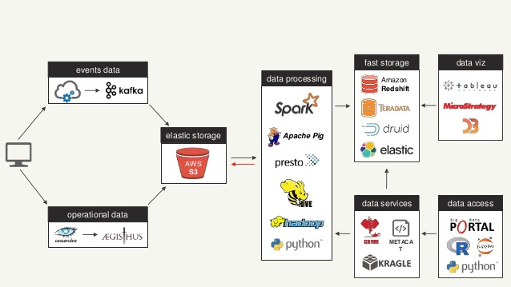

# QA Section

1. Github links & Project Brief\
  \
  **Back-end [[Link](https://github.com/asjadjawed/short-url-server)]:**\
  The project was built using: Node.js (JavaScript) + MongoDB Atlas + Docker + Heroku. It has docker setup for dev and prod environments. The back-end is a REST API and can can be horizontally scaled on any platform supporting Docker.\
  \
  **Front-end [[Link](https://github.com/asjadjawed/short-url-client)]:**\
  The project was built using: React.js and deployed on Netlify. Basic UI layout with CSS sanitization. The build generates static assets that can be placed on any CDN for a highly available and cost-effective front-end solution. It is also decoupled from the back-end so can be worked on independently.\
  *(This can also be containerized, but with specialized build tools like Netlify for React deployment, it is easier to use these)* However, an example docker implementation of a React.js with CI/CD can be found [here](https://github.com/asjadjawed/docker-react) in my repo.\
  \
  **Design Decisions:**

     - Node.js with JavaScript was used as this is a preferred language by the company.
     - MongoDB cloud atlas for highly scalable and fast DB, with indexing support to deter collisions (discussed further on). Flexible Schema if we want to implement more features or vary slug size, since this data is mostly non-relational and simple.
     - React.js (using JavaScript) for a simple client-side UI.
     - Docker for easy, flexible and consistent deployment and testing.
     - Heroku for easy and free deployment using Docker containers
     - Netlify for specialized React.js deployment.
     - NanoID for slug generation (discussed in algorithms section)
     - Normalization of user input urls.
     - The back-end was structured MVC style (popular choice), it can also be structured component style.
     - No caching was implemented, this can be added later.
     - No need for a distributed synchronization service like Apache Zookeeper which will complicate implementation and may lead to vulnerabilities associated with a range / counter implementation. Randomization and collision concerns discussed below.

2. What properties should a shortened URL possess, and what architectural
decisions or algorithms would you devise to guarantee those properties?\
  \
  A short-url should posses the following properties:

     - It should be short
     - It should be unique and avoid collisions (duplications while generating)
     - It should be quickly generated
     - It should not be sequential
     - It should have unique and uniform distribution while generating from a pool
     - It should avoid abusive words
     - It should scale and allow millions of users to generated unique urls fast, reliably without collisions.

    Usually the algorithms used for slug generation are [MD5](https://www.wikiwand.com/en/MD5) (which may lead to collisions) or [base64](https://www.wikiwand.com/en/Base64#/URL_applications) encoding (which leads to long slugs and in some cases non-uniform distribution of character pool in basic implementations)

    UUIDs can also be used like [UUID-V4](https://www.wikiwand.com/en/Universally_unique_identifier#/Version_4_(random)) or others. But these are also long, however have low collision.

    For this project I used NanoID. The source code of the algorithm, be found [here](https://github.com/ai/nanoid/blob/main/index.js). It has the following advantages:

      - *Small.* 108 bytes (minified and g-zipped). No dependencies. Size Limit controls the size.
      - *Fast.* It is 60% faster than UUID.
      - *Safe.* It uses cryptographically strong random APIs. Can be used in clusters.
      - *Compact.* It uses a larger alphabet than UUID (A-Za-z0-9_-). So ID size was reduced from 36 to 21 symbols.
      - *Unpredictability.* Instead of using the unsafe Math.random(), Nano ID uses the crypto module in Node.js and the Web Crypto API in browsers. These modules use unpredictable hardware random generator.
      - *Uniformity.* random % alphabet is a popular mistake to make when coding an ID generator. The distribution will not be even; there will be a lower chance for some symbols to appear compared to others. So, it will reduce the number of tries when brute-forcing. Nano ID uses a better algorithm and is tested for uniformity.
      

      The collision calculation can be done [here](https://zelark.github.io/nano-id-cc/)

      For this project with the slug size of 12, this can accommodate around 8-9 million users per year i.e. approx 1000 requests per hour.\
      **~1 thousand years needed, in order to have a 1% probability of at least one collision.**

      The slug size can also be increased if users grow exponentially. The slugs are stored in MongoDB with a unique restriction so the DB won't allow any duplicates. The user can then generate another random slug in the very unlikely case of a collision.

3. What do you feel are the limitations or vulnerabilities of your submitted solution? What should be done to address these limitations or vulnerabilities?\

     - I need to buy a custom domain, as the free-tier heroku or netlify apps are long and the aesthetics of a short-url is ruined with a long domain name, but this is a sample project.
     - The project also doesn't filter for any abusive or illegal or harmful websites that users may submit, and may lure people to harmful places. A service like [Google Safe Browsing](https://developers.google.com/safe-browsing/v4/lists) can be used.
     - The randomly generated URL slugs may contain abusive words, the can be filtered and checked against dictionaries. An package example can be found [here](https://github.com/y-gagar1n/nanoid-good) for various languages.
     - Spamming of service using bots and scripting, can be mitigated by some kind of [captcha service](https://developers.google.com/recaptcha/docs/display).
     - The short-urls should allow for deletion when created by users or anonymously. Partially implemented in back-end using secrets.
     - Allow for user login and url management. Authentication and authorization can be setup.
     - Allow for expiry of URLs. (Discussed below)
     - Allow for analytics (Discussed below)

4. We would like to allow the users to specify an expiration period for the
generated URL. How would you accommodate this feature into your
solution?\
  \
  This can be easily implemented by using [mongodb TTL indexes](https://docs.mongodb.com/manual/core/index-ttl/) in case of this solution. The front-end can be edited to provide a duration / time for when the link should expire.

5. We would like to give users a real-time dashboard against each URL
generated, which they can use to monitor analytics regarding the usage of
that generated URL. What sort of architecture would you propose we
implement to do that?\
  \
  Small-scale analytics can be done using the same architecture with request analysis for origin, browser, etc. 3rd-party services can also be used like Google Analytics.
  \
  But to design a proper highly scalable and available architecture ourselves we have to uses services like:

    - [AWS Kinesis](https://aws.amazon.com/kinesis/) which is a highly scalable realtime data streaming service. This is where user activity and info is streamed using event driven collection. The stream itself can also be analyzed using [AWS Lambda](https://aws.amazon.com/lambda/).
    - The stream can than be stored into [AWS S3](https://aws.amazon.com/s3/) where simple analysis can be done using [AWS Athena](https://aws.amazon.com/athena/) or ELK stack can also be used.
    - The stream data (selectively) can also alternatively send data to a Data Warehouse service for fast access like [AWS Redshift](https://aws.amazon.com/redshift/) directly from Kinesis using [Kinesis Firehose](https://aws.amazon.com/kinesis/data-firehose/), this service can also be used to deliver data to S3.
    - Redshift can then be analyzed via various big data tools, such as Spark, Presto, Jupyter, Python Language (with its huge data analysis eco-system).
    - Real-time Dashboards and graphs can also be built using data visualization tools like D3 or tableau.

    \
    *This is just an example of the various services that can be used they can be scaled up and down and services added or removed as per client needs.*

6. We would like to prevent abuse of the service by making sure that only
human users can submit URLs to be shortened (as opposed to spam bots
and scripts). But we would also like to let other applications (e.g. Slack
and Skype etc.) use our service. How do you propose we go about doing
that?\
  \
  If we want to limit the service to registered users this can be achieved by having a authentication and authorization system in place.\
  For anonymous usage we can have the solve a captcha like the example given above in the text.\
  \
  In can we want other platforms and applications to access our API, we can issue have them register with us so they can be issued tokens, which will then be authenticated by our app to grant them access.
